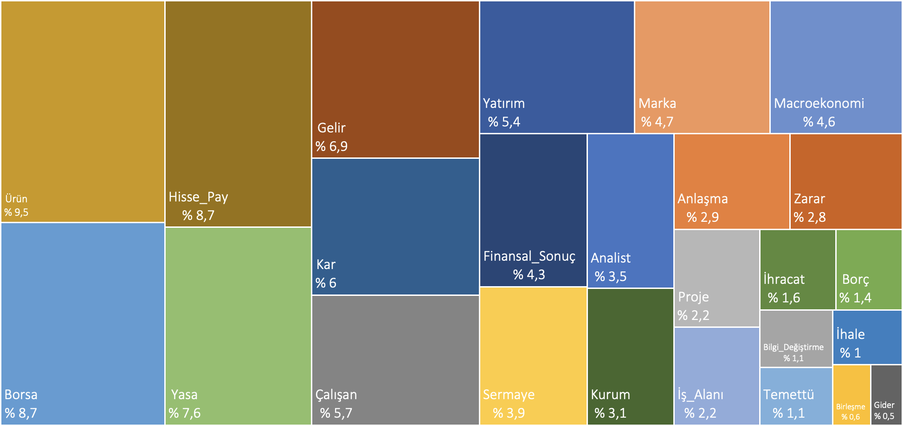

### [TR](README.md) | [EN](README_EN.md)
<center><h1>TFEEC : TÜRKÇE FİNANSAL OLAY ÇIKARIM DERLEMİ</h1></center> 

### Türkçe Finansal Olay Çıkarımı için Veri Kümesi
Türkçe haberlerden finansal ve ekonomik  olayların çıkarılmasını sağlayacak bir veri kümesi sunuyoruz. Bu çalışma için 2010-2022 yılları arasında farklı www.borsagundem.com internet sitesinde paylaşılan şirkete özel haber makalelerini topladık. Toplanan toplam 34.746 haber makalesinin 600 tanesi elle işaretlenmiştir, geri kalan 34.146 tanesi ise zayıf denetim methodları kullanılarak otomatik olarak etiketlendirilmiştir.

Bu alanda yapılacak gelecek çalışmalara katkı sağlamak amacıyla veri setimiz herkese açıktır.

<br/>

### Veri Kümesi Bilgisi
| | Referans Eğitim Kümesi  | Referans Test Kümesi | Otomatik Etiketli Küme |
|--:|:--:|:--:|:--:|
|Dokümanlar   | 500     | 100     | 34.146    |
|Cümleler     | 5.393   | 856     | 317.696   |
|Kelimeler    | 100.109 | 17.097  | 6.063.037 |
|Olaylar      | 6.604   | 1.220   | 303.480   |
|Argümanlar   | 7.684   | 1.464   | 377.011   |

<br/>

### Veri Kümesindeki Olay Tür ve Alt Türleri
| Olay Türü | Olay Alt Türü |
|--:|--|
|Analist|Beklenti, Raporlama, Tavsiye|
|Anlaşma||
|Bilgi Değiştirme|İsim Değiştirme, Logo Değiştirme|
|Birleşme||
|Borç||
|Borsa|Halka Arz, İşlem Görme, Pazara Girme, Pazardan Çıkma|
|Çalışan|Atama, Değişiklik, Grev, İş Sözleşmesi, İşten Çıkarma, İstifa, İstihdam, Kaza, Ölüm|
|Finansal Sonuç|Dönem Bilançosu, Kredi Notu, Mali Tablo, Satış Hacmi|
|Gelir|Artış, Azalış, Duyuru|
|Gider|Artış, Azalış, Duyuru|
|Hisse Pay|Alış, Devri, Dönüşüm, Fiyat Hedefi, Geri Alma, Rehin, Satış|
|İhale||
|İhracat||
|İş Alanı|Açma, Alış, Kapama, Satış|
|Kar|Artış, Azalış, Duyuru|
|Kurum|Açma, Bölünme, İflas, Kapama, Yeniden Yapılanma|
|Macroekonomi|Devalüasyon, Endeks, Enflasyon, Faiz, İşsizlik, Milli Gelir, Pazar Payı, Zam|
|Marka|Etik, Hibe, İmaj, Kadına Şiddet, Ödül, Reklam, Rüşvet, Skandal, Sosyal Sorumluluk, Spekülasyon, Sponsor, Üyelik, Yolsuzluk|
|Proje||
|Sermaye|Arttırma, Azaltma, Payı, Tavanı|
|Temettü||
|Ürün|Alma, Çeşitlendirme, İmalat, Lansman, Satma, Üretime Ara Verme, Üretime Başlama, Üretime Devam Etme, Üretime Son Verme|
|Yasa|Beraat, Ceza, Dava, İhlal, İtiraz, Soruşturma, Suç Duyurusu, Tazminat, Tedbir, Uzlaşma, Yargılama, Yasal İşlem|
|Yatırım||
|Zarar|Artış, Azalış, Duyuru|

<br />

### Referans Kümesindeki olay frekans dağılımı


<br />
<!---
### Çalışmanızda bu veri setini kullanıyorsanız, lütfen aşağıdaki makaleye atıfta bulunun
```bibtex
@article{sima2001building,
  title={Building a tree-bank of modern Hebrew text},
  author={Sima’an, Khalil and Itai, Alon and Winter, Yoad and Altman, Alon and Nativ, Noa},
  journal={Traitement Automatique des Langues},
  volume={42},
  number={2},
  pages={247--380},
  year={2001},
  publisher={Citeseer}
}
```
<br />
-->

Bu çalışmadaki etiketleme işlemleri [WebAnno Annotation Tool](https://webanno.github.io/webanno/) kullanılarak gerçekleştirilmiştir.
