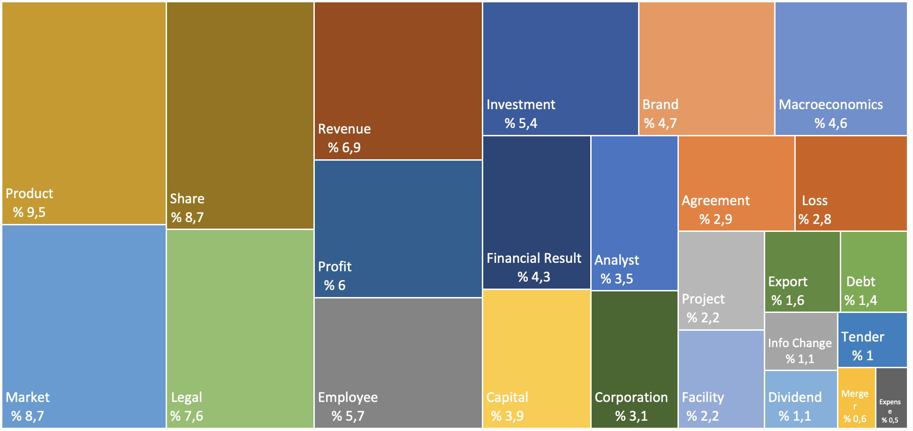
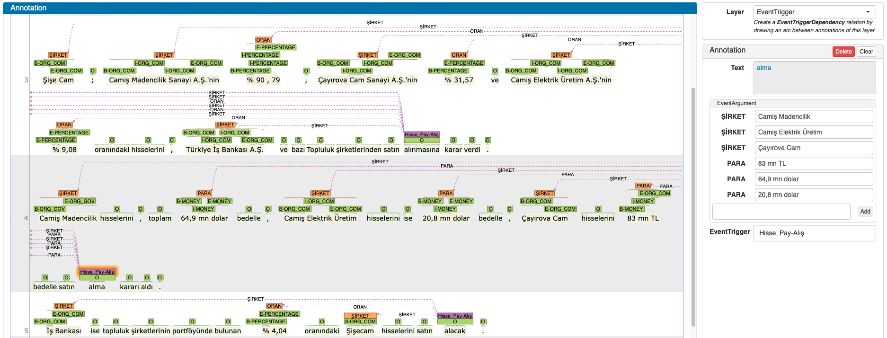
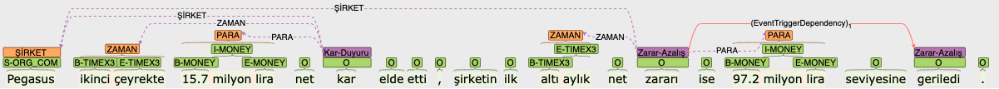

### [TR](README.md) | [EN](README_EN.md)
<center><h1>TFEEC : TURKISH FINANCIAL EVENT EXTRACTION CORPUS</h1></center> 

### Dataset for Turkish Financial Event Extraction
We present a dataset that will enable the extraction of financial and economic events from Turkish news. For this study, we collected company-specific news articles shared on www.borsagundem.com between 2010-2022. A total of 34,746 news articles were collected, of which 600 were hand-marked and the remaining 34,146 were automatically tagged using weak supervision methods.

In order to contribute to future studies in this field, our dataset is open to everyone.

<br/>

### Dataset Information
| | Gold Train Set | Gold Test Set | Automatically Labeled Set |
|--:|:--:|:--:|:--:|
|Documents  | 500     | 100     | 34.146    |
|Sentences  | 5.393   | 856     | 317.696   |
|Tokens     | 100.109 | 17.097  | 6.063.037 |
|Events     | 6.604   | 1.220   | 303.480   |
|Arguments  | 7.684   | 1.464   | 377.011   |

<br/>

### Event Type and Subtypes in Dataset
| Event Type | Event SubType |
|--:|--|
|Analyst|Expectation, Reporting, Advice|
|Agreement||
|Info Change|Name Change, Icon Change|
|Merger||
|Debt||
|Market|Public Offering, Be Traded, Market Penetration, Exit from Market|
|Employee|Assignment, Change, Strike, Business arrangement, Layoff, Resign, Employment, Accident, Death|
|Financial Result|Period Balance, Credit Rating, Financial Statement, Sales Volume|
|Revenue|Increase, Decrease, Announcement|
|Expense|Increase, Decrease, Announcement|
|Share|Buying, Turnover, Transformation, Price Target, Rollback, Pledge, Sales|
|Tender||
|Export||
|Facility|Opening, Buying, Shutdown, Sales|
|Profit|Increase, Decrease, Announcement|
|Corporation|Establish, Division, Bankruptcy, Shutdown, Reconstruction|
|Macroeconomics|Devaluation, Inflation, Interest, Price Index, Unemployment, National Income, Market share, Interest|
|Brand|Ethic, Grant, Image, Violence Against Women, Prize, Advertisement, Bribe, Scandal, Social Responsibility, Speculation, Sponsor, Membership, Corruption|
|Project||
|Capital|Increase, Share, Equity Ceiling, Decrease|
|Dividend||
|Product|Taking, Diversification, Production, Launch, Sales, Continue Production, Pause Production, Production Start, Discontinue Production|
|Legal|Acquittal, Punishment, Case, Breach, Objection, Investigation, Denunciation, Compensation, Precaution, Compromise, Trial, Legal Action|
|Investment||
|Loss|Increase, Decrease, Announcement|

<br />

### Event frequency distribution in the gold set


### Sample Annotation - Document


### Sample Annotation - Sentence


<br />
<!---
### If you make use of this dataset in your work, please kindly cite the following paper
```bibtex
@article{sima2001building,
  title={Building a tree-bank of modern Hebrew text},
  author={Sima’an, Khalil and Itai, Alon and Winter, Yoad and Altman, Alon and Nativ, Noa},
  journal={Traitement Automatique des Langues},
  volume={42},
  number={2},
  pages={247--380},
  year={2001},
  publisher={Citeseer}
}
```
<br />
-->

The annotation operations in this study were carried out using the [WebAnno Annotation Tool](https://webanno.github.io/webanno/).

Cite : 
https://link.springer.com/chapter/10.1007/978-3-031-23210-7_5#chapter-info

